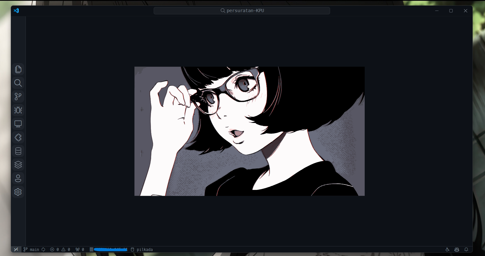
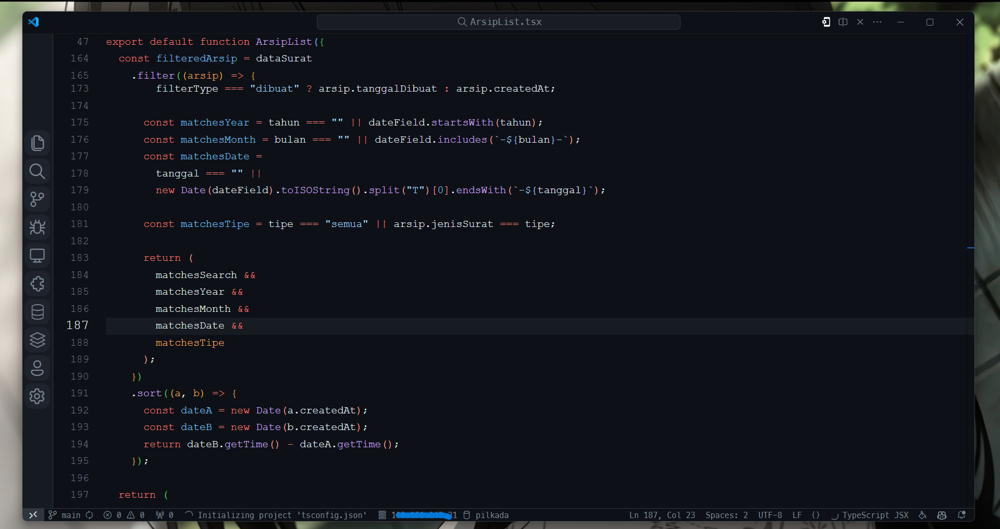

# VSCode Style Configurations

This repository contains configuration files to customize the appearance of Visual Studio Code (VSCode) for a more comfortable user experience.

<div Style="display: flex; justify-content: space-around; gap: 25px;">
  
  
</div>


## Extensions

- [Custom CSS and JS Loader](https://marketplace.visualstudio.com/items?itemName=be5invis.vscode-custom-css)

---

## Configurations

To apply custom styles, add the following paths to your settings:

```json
"vscode_custom_css.imports": [
    "file:///C:/Users/[username]/.vscode/style.css",
    "file:///C:/Users/[username]/.vscode/script.js"
]
```

---

## Example of Custom VSCode Look

*(not yet)*

---

## Reference

- Developed by [nursandiid](https://github.com/nursandiid)  
  

---

## License

This project is licensed under the [MIT License](https://choosealicense.com/licenses/mit/).

---

## Additional Resources

- **VSCode Customization Guide** *(optional link to a VSCode customization article)*
- **Frequently Asked Questions** *(link to a helpful FAQ section)*

---


### Notes:
1. Place the image in an `assets` folder within your project, or adjust the path in `` to match its location.
2. This "Preview" section can help readers quickly understand the setup and appearance of the VSCode customization. 

Let me know if this works for you or if you'd like further adjustments!

This layout includes structured sections, separators, and placeholders for additional resources and images to make it more engaging and informative. Let me know if you'd like help with any specific section or further customization!